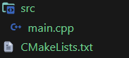
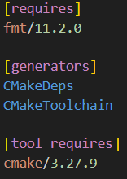
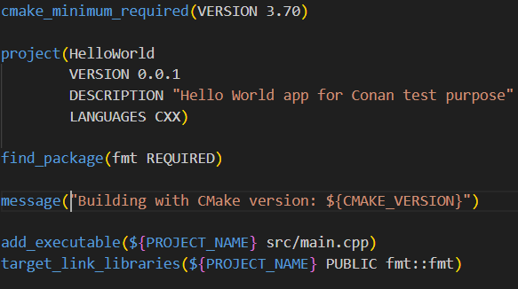

# Using build tools as Conan packages
In a previous article, we try to build our CMake project and used Conan to install the needed Dependencies that is fmt.

:toc:
:sectnums:

== Introduction
Although we create a project including Conan in order to pull the `fmt` library from the center, what happens if you want to builld our project with a specific CMake version ? The version is diferent from the one you already installed system-wide ?

Well, that's where Conan also helps, it install these tools and use them to compile consumer projects or other Conan packages. In this case, you can declare this dependency in Conan using a type of requirement named `tool_requires`. Let's see an example of how to add a `tool_requires` section in the previous _conanfile.txt_ file.

== Structure
In order to show you how the `[tool_requires]` section is used in the _conanfile.txt_ file, we won't do anything other than pull the previous project, so you should have the structure as follow:



== Main difference
The main difference between this article and the one before that one is the _conanfile.txt_ file should have a new section as well as a new element on it like so:



NOTE: Please, note that this _conanfile.txt_ will install fmt/11.2.0 and cmake/3.27.9 separately. However, if Conan does not find a binary for _fmt_ in Conan Center and it needs to be built from sources, a CMake installation must already be present on your system, because the `cmake/3.27.9` declared in your _conanfile.txt_ only applies to your current project, not all dependencies. If you want to use that `cmake/3.27.9` to also build _fmt::fmt_, when installing if necessary, you may add the `[tool_requires]` section to the profile you are using.

Let's also add a message in the _CMakeLists.txt_ file to see the version of CMake we are using:



Now, as in the previous example, we'll use Conan to fetch _fmt_ library and install the dependency with the _CMake_ installed in our system and after that, install _CMake 2.27.9_ to build the project:

```sh
$ conan install . --output-folder=build --build=missing
...
['conanbuild.bat', 'conanrun.bat']
Install finished successfully
```

NOTE: Now, if you check your _build_ folder you'll see that Conan generated a new file named `conanbuild.sh/bat`. This is the result of automatically invoking a `VirtualBuildEnv` generator when we declared the `tool_requires` in the *conanfile.txt*. This file sets some environment variables like a new `Path` that we can use to inject the location of our new CMake version 3.27.9 into our environment.

Once that's done, activate your new virtual environment, and run `cmake --version` to check that you have installed the new _CMake_ version in the path like so:

```bash
$ cd build
$ conanbuild.bat
```

Then run cmake:

```bash
$ cmake --version
# cmake version 3.27.9
```

IMPORTANT: Once you finished to build and compile your project with the required version, you can deactivate the environment using the following command: `$ deactivate_conanbuild.bat`